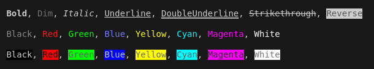

# **[SuperZIG](https://github.com/Super-ZIG)** \ ANSI 🎨

A simple and efficient **ANSI escape code** library for the **ZIG** programming language.  

Easily apply text styles and manage color codes in terminal applications. 🖥️

> 

## Features ✨

- **🎨 Text Styling**  
    > Apply styles like bold, underline, and more.

- **🌈 Color Support**  
    > Predefined colors and support for custom `RGB`/`HEX` values for foreground and background.

- **🧹 ANSI Code Removal**  
    > Remove all ANSI escape codes from strings for clean output.

- **🌍 Platform Compatibility**
    > Supports Windows, Linux and macOS.
  
- **📦 Single File Usage**  
    > Use the lightweight version directly by dragging `ansi.min.zig` into your project.


## Usage 📖

Here are some of the main methods you can use in **SuperZIG - ANSI** :

- ### [`style`](./docs/func/style.md) ✨

    Applies ANSI styles (foreground, background, and attributes) to a string.

    > _you can apply **single style** like the following :_

    ```zig
    try io.outWith( "{s}", .{ try ansi.style("Bold" , .{ .attr =.Bold } ) } );
    ```
    > 

    ```zig
    try io.outWith( "{s}", .{ try ansi.style("RedFG", .{ .fg   =.Red  } ) } );
    ```
    > 

    ```zig
    try io.outWith( "{s}", .{ try ansi.style("RedBG", .{ .bg   =.Red  } ) } );
    ```
    > 

    > _or you can **mix styles** like the following :_

    ```zig
    try io.outWith
    ( 
        "{s}",
        .{ 
            try ansi.style
            (
                "Black/Red/Bold",

                .{ 
                    .fgHEX  = 0x000000,     // you can use: [ .fg | .fgHEX | .fgRGB ]
                    .bgRGB  = .{ 255,0,0 }, // you can use: [ .bg | .bgHEX | .bgRGB ]
                    .attr   = .Bold 
                }
            ) 
        }
    );
    ```
    > 
    
- ## Installation 📦

    > You can use the library in two ways :

    - ### **Option 1: Single File Integration**

        - Download the [`ansi.min.zig`](./dist/ansi.min.zig) file.  
        - Add it to your project directory.  
        - Import it in your code:

            ```zig
            const ansi = @import("path/to/your/ansi.min.zig");
            ```

    - ### **Option 2: Zig Dependency**

        1. Add the dependency to `build.zig.zon`:

            > **Replace** `_version` _with_ **last version**.

            > **Replace** `_hash` _with_ **hash provided by zig builder**.

            ```zig
            .dependencies = 
            .{
                .ansi = 
                .{
                    .url    = "https://github.com/Super-ZIG/ansi/archive/refs/tags/_version.tar.gz",
                    .hash   = "_hash"
                },
            };
            ```

        2. Modify your `build.zig` file:

            > Add the following after declaring the executable. 

            ```zig
            const ansi = b.dependency("ansi",
            .{
                .target     = target,
                .optimize   = optimize,
            });

            exe.root_module.addImport("ansi", ansi.module("ansi"));
            ```

        3. Import the library in your code:

            ```zig
            const ansi = @import("ansi");
            ```

- ## [Documentation 📚](./docs/readme.md)

    > For detailed information, visit the [`/docs`](./docs/readme.md) folder.

    ---

    - ### Support the Project ❤️

        > If you enjoy using **SuperZIG** and want to support its development, consider buying me a coffee or sending a small donation!
        
        > Your support helps me dedicate more time to improving this project and creating more amazing tools for the community :)

        - [Donate via **✨ PayPal**](https://www.paypal.me/MaysaraElshewehy)
          
          _OR_

        - [Buy me a coffee on **☕ Ko-fi**](https://ko-fi.com/codeguild)

        Thank you for your generosity and encouragement! 💖
    ---
    
    - ### Testing

        ```bash
        zig test test.zig     # run tests
        zig build try         # try examples
        ```

    - ### Contributing 🤝

        > Contributions are always welcome! Feel free to open issues, fork the repository, or submit pull requests.

        - Fork the project.
        - Create your feature branch.
        - Write tests and Testing.
        - Commit your changes.
        - Push to the branch.
        - Open a pull request.

    - ### Author 💻

        > If you encounter any problems or have any suggestions, please feel free to contact me at :

        - 📧 `Email` [maysara.elshewehy@gmail.com](mailto:mmaysara.elshewehy@gmail.com)  
        
        - 🌐 `GitHub` [github.com/maysara-elshewehy](https://github.com/maysara-elshewehy)  


    - ### License 📄

        This project is licensed under the MIT License - see the [LICENSE](./LICENSE) file for details.

    - ##### TODO

        > .. ?

    - ##### Related
        
        - [`SuperZIG IO`](https://github.com/Super-ZIG/io)
        - [`SuperZIG CLI`](https://github.com/Super-ZIG/cli)
      
---

Made with ❤️ by [Maysara](http://github.com/maysara-elshewehy).